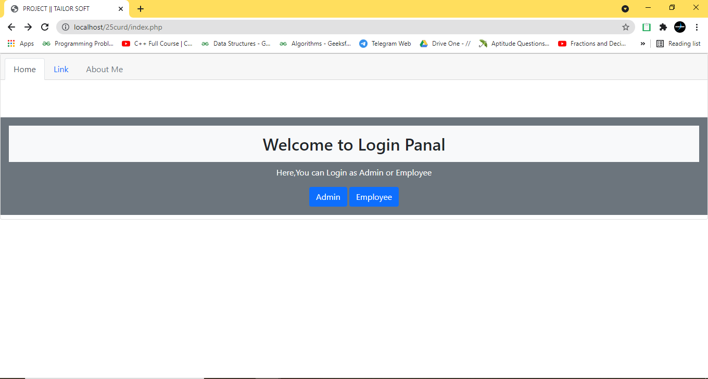
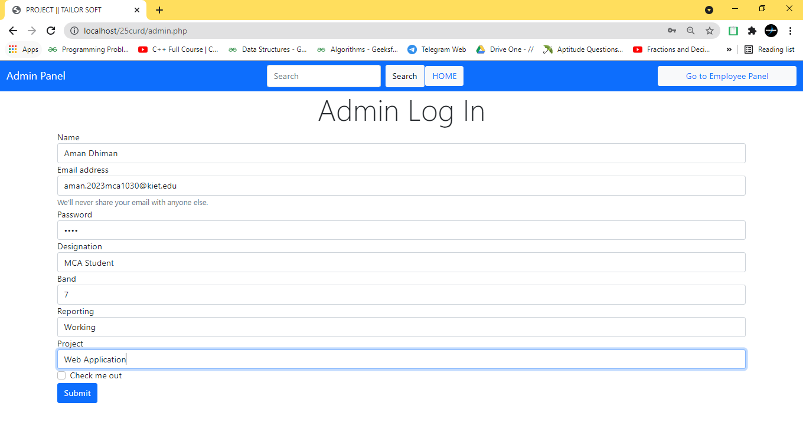
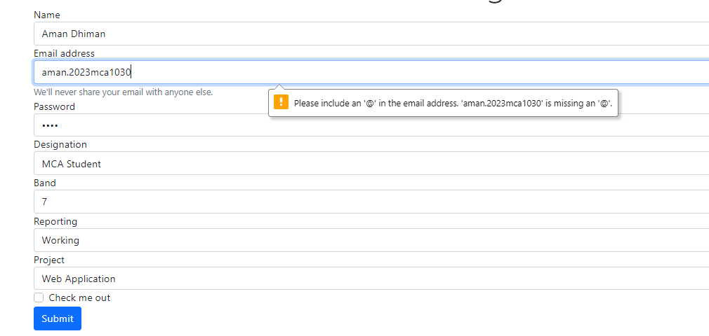
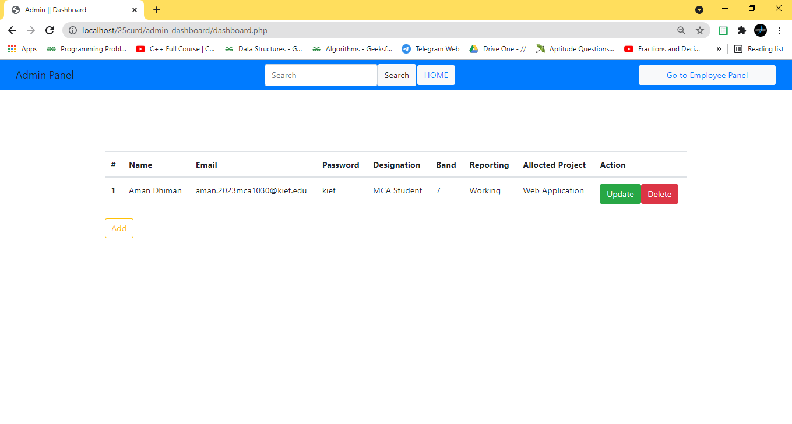
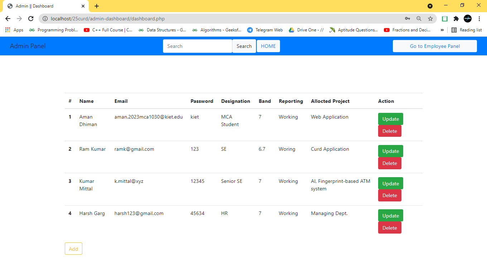
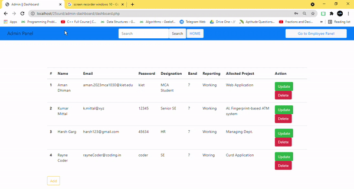
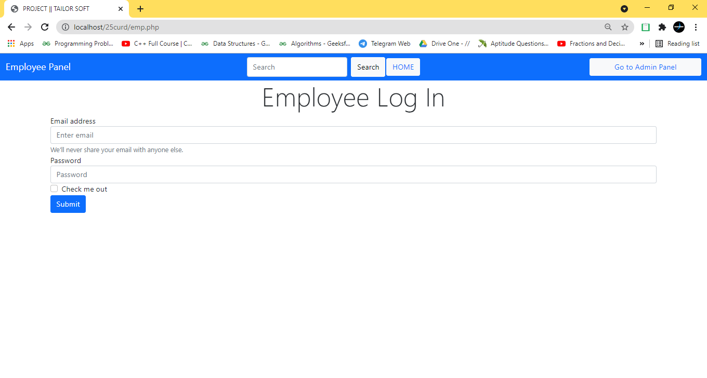
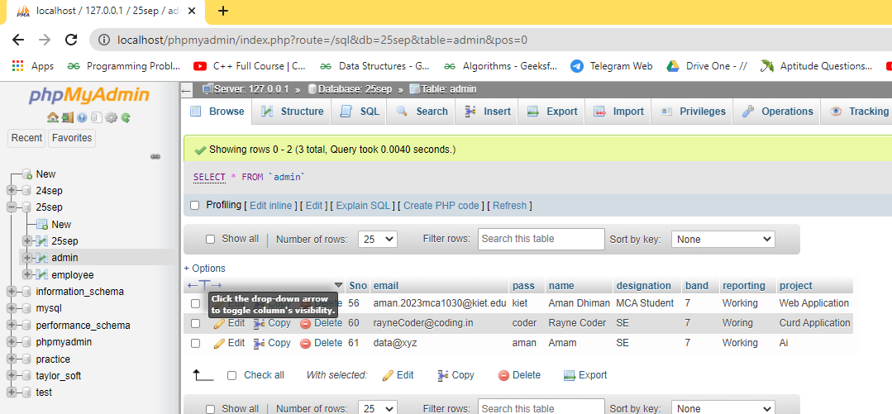
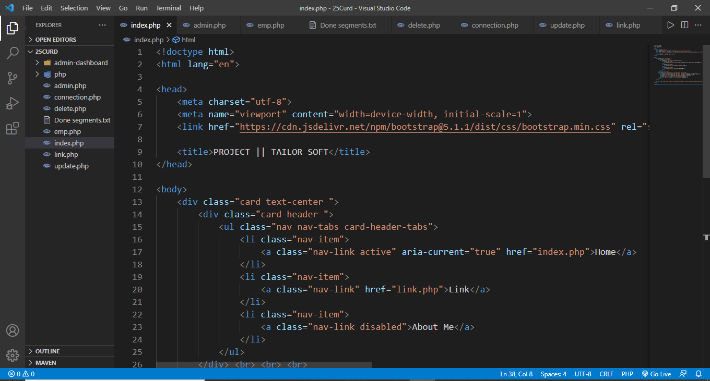

# TailorSoft
TailorSoft Project
# Technology Used
------------
- Front End : HTML CSS & Bootstrap
- Back End : PHP 
- Database : MySql   
**Code Editor :- VScode**
------------
### Welcome Page
>  
> 

### Admin Panel
> 
## Case Handle
> 
## Admin Dashboard  
Add, delete & update the Details
> 
> 
### Delete the data
> 
## Employee Dashboard 
> 

# Admin DATABASE
> 

# Work Directory
> 

