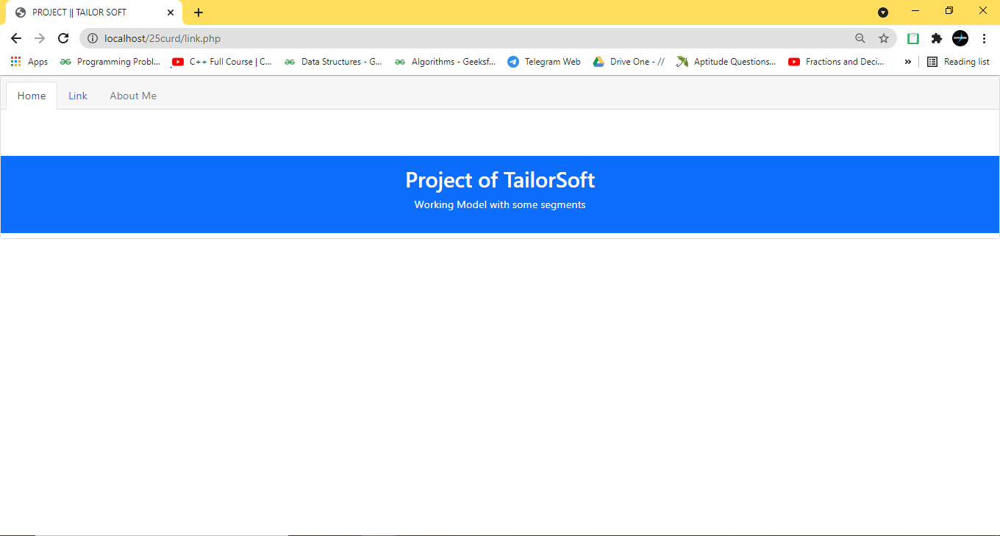

# TailorSoft
TailorSoft Project 
# Technology Used 
------------
- Front End  : HTML CSS & Bootstrap  
- Back End   : PHP 
- Database   : MySql   
**Code Editor :- VScode**
------------
### Welcome Page
>  
> 
------------
### Admin Panel
> 
------------
## Case Handle
> 
------------
## Admin Dashboard  
Add, delete & update the Details
> 
> 
------------
### Delete the data
> 
------------
## Employee Dashboard 
> 
------------
# Admin DATABASE
> 
------------
# Work Directory
> 
------------

